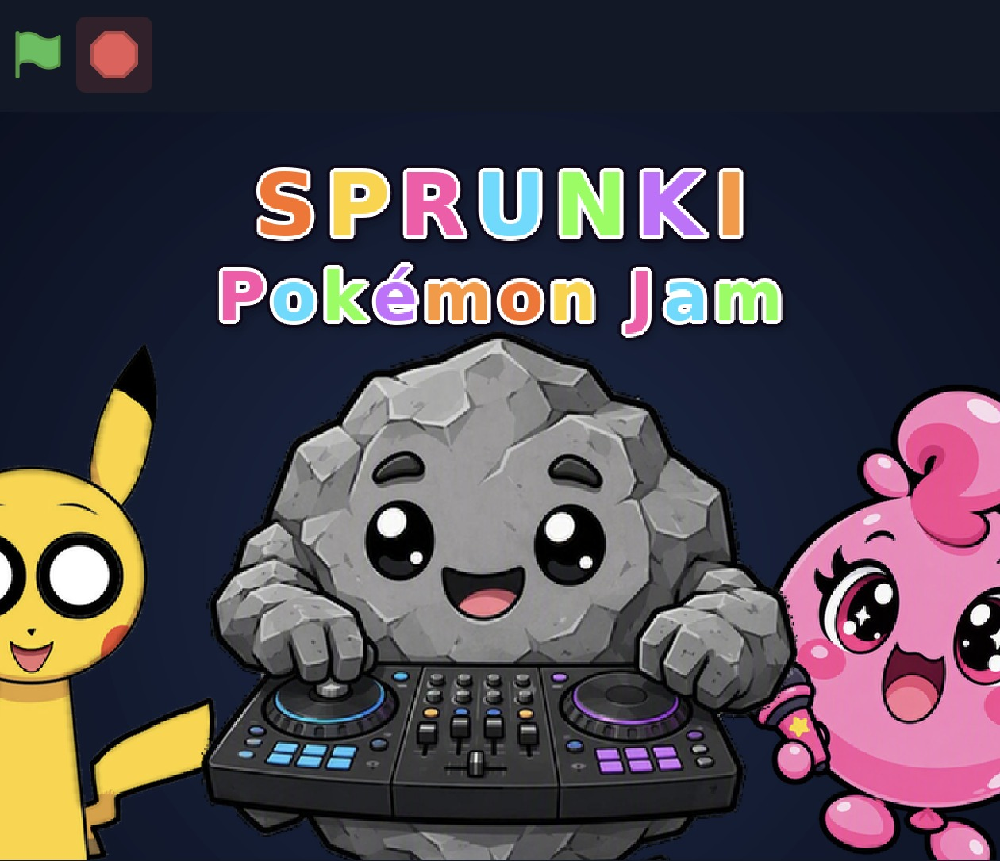
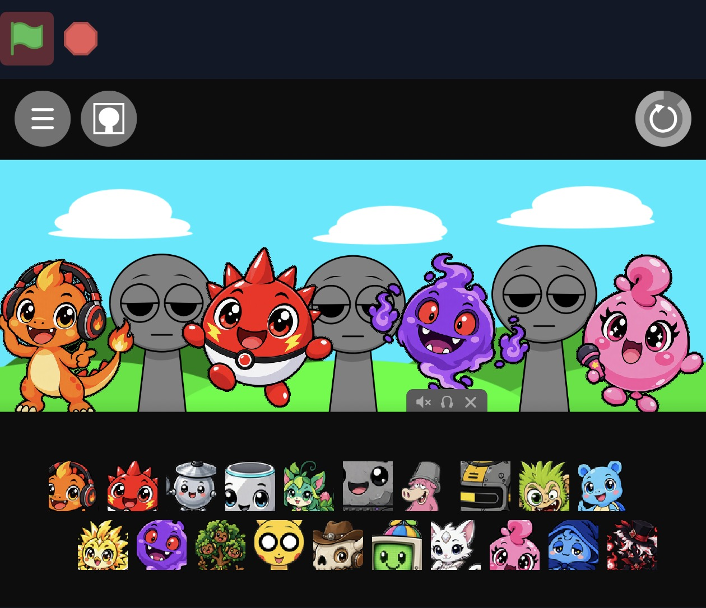
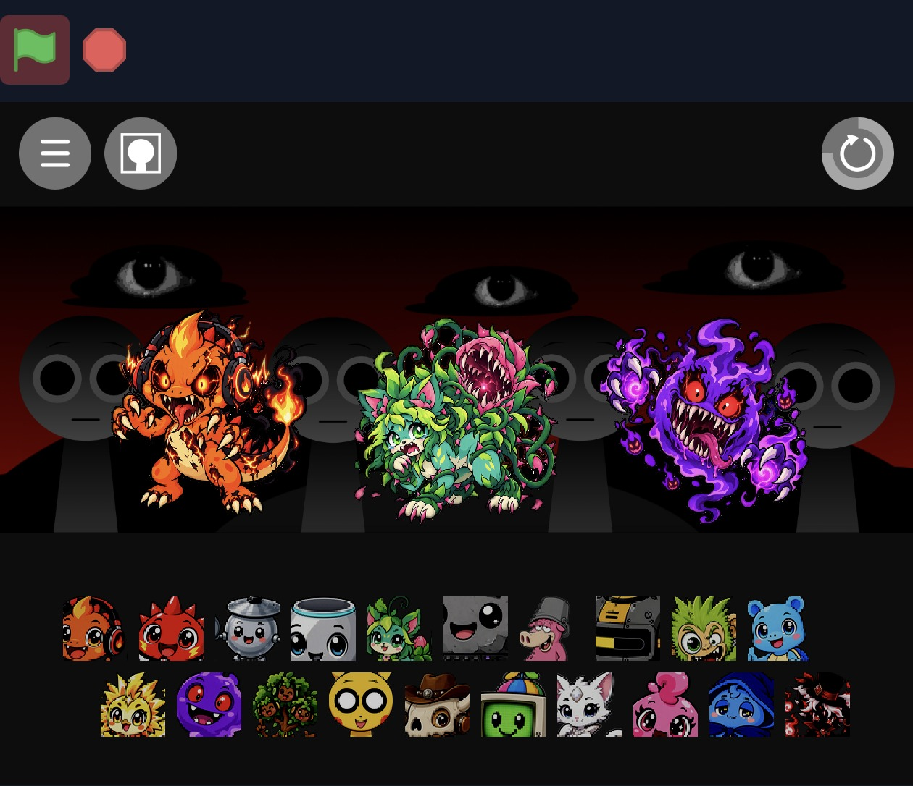

# Sprunki Pokémon Jam

**[▶ Play on GitHub Pages](https://sprunkijam.github.io/sprunkipokemonjam/)** · **[Play on itch.io](https://sprunkijam.itch.io/sprunkipokemonjam)**

The **GitHub Pages** link opens the jam directly in your browser. That usually works better than itch.io's embedded player: sound plays more reliably, and full screen uses more of the phone display. **itch.io** still plays great — handy if you already live there or want the itch.io page.

<p align="center">
  
</p>

<p align="center">
  
  &nbsp;
  
</p>

---

Welcome to **Sprunki Pokémon Jam** — a Pokémon-inspired classic Sprunki mixer. Drag characters onto the stage, stack beats and melodies Incredibox / Sprunki style, and flip into Phase 2 for a wilder look and sound.

Free to play in the browser. Works on **all modern web browsers**, on **smartphones and tablets**, and on **Windows, Mac, and Linux**.

## Play

1. Open the jam in a modern browser (phone, tablet, or desktop) — prefer **[GitHub Pages](https://sprunkijam.github.io/sprunkipokemonjam/)** for the most reliable sound and full screen; **[itch.io](https://sprunkijam.itch.io/sprunkipokemonjam)** is a great alternate host.
2. **Tap / click** the launch screen to unlock audio (browsers block autoplay), then start the green flag.
3. Drag characters from the tray onto the stage polos to layer loops.
4. Trigger **Phase 2** when you are ready for the horror / alt costumes and sounds.
5. Use mute / reset controls as in classic Sprunki — clear the stage and remix freely.

Portrait and landscape both work. Fat targets, familiar Sprunki layout, TurboWarp runtime under the hood.

[CREDITS.md](./CREDITS.md)

<details>
<summary><span style="font-size: 1.5em; font-weight: 600; line-height: 1.25;">Developers</span></summary>

### Local build

```bash
npm ci
npm run build
```

Static site output is written to `dist/` (open `dist/index.html` or serve that folder).

Each build also writes `dist/version.json` and injects a small update checker into `index.html`. Open tabs poll for a new build every ~45s (and when the tab becomes visible again). If a newer deploy is live while you are still on the loading/launch screen, the page auto-reloads once; if you are mid-mix, a tap-to-update banner appears instead of interrupting playback.

### itch.io HTML5 zip

1. Run `npm run build`.
2. In Explorer, open **`dist`**, Select All, right-click → **Send to → Compressed (zipped) folder**.
3. Upload that zip as an HTML5 game on itch.io. `index.html` must be at the zip root (siblings: `assets/`, …).

Do **not** use PowerShell `Compress-Archive` — itch.io does not unpack nested folders from those zips correctly. Do not zip the `dist` folder as a single top-level directory.

Relative asset paths are already set for itch / Pages-style hosting.

### Project notes

- Source Scratch/TurboWarp project: `sprunki-base.sb3`
- Packager: `scripts/build.mjs` via `@turbowarp/packager`
- GitHub Actions rebuilds `dist/` on push to `main` for Pages

</details>
